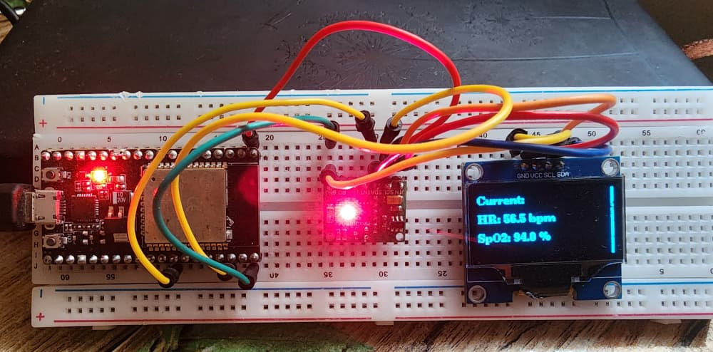
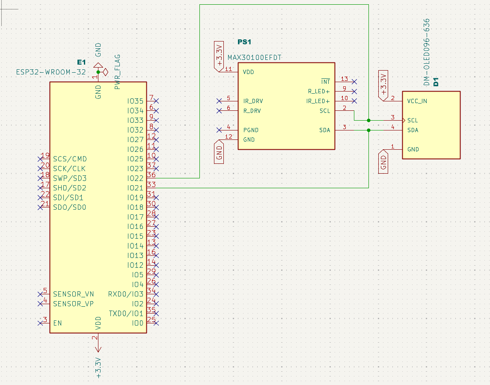

# DESIGN AND CONSTRUCTION OF A HEART RATE MONITOR 

Authors: 
- Somtochukwu Emeka-Onwuneme 
- Kofi Aseda Ayeh-Bampoe
- John Awolu 

## 1. Introduction

With the advent of miniscule SoCs, wearables have become commonplace in our modern society. This project presents the technical documentation of the design process involved in the development of a Heart Rate Monitor, from the schematic layout to the PCB design. 

## 2. Methodology

### Developing a prototype



*Component labels (L-R): ESP32 dev board (WROOM-32), MAX30100 pulse oximeter, 128x64 I2C OLED.*

To develop the prototype, one needs the following components:
- An ESP32 dev board 
- A MAX30100 pulse oximeter
- An I2C OLED
- A breadboard

The simple schematic below shows the relevant connections to build the prototype 

Once the relevant connections have been completed, upload the firmware to the ESP32 Dev board: [```hrm_firmware```](hrm_firmware.ino)

## BREAKING DOWN THE FIRMWARE 